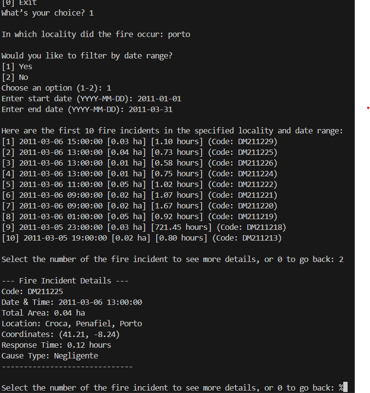

# Fire Incident Management System

The *Fire Incident Management System* is a comprehensive tool for managing and analyzing fire-related data, including incidents, firefighter records, vehicle assignments, and station resources. Built with Python, PostgreSQL, and data visualization libraries, this system enables efficient fire data management, incident tracking, resource allocation, and statistical analysis.

## Key Functionalities

- **Incident and Resource Management**: Track fire incidents and manage firefighters, vehicles, and station resources.
- **Data Visualization**: Gain insights through clear data visualizations.
- **CSV Export**: Export data for external analysis and reporting.
- **User-Friendly Interface**: Simple, intuitive, and includes error-checking for input accuracy.

> **Note**: Maximize terminal width and height for optimal readability and a better user experience.

## Project Structure

- **fires.py**: Contains the main application logic, including functions to search for fire incidents, manage resources, visualize data, and export information.
- **fires.sql**: SQL script for setting up the database schema.
- **load_fires.py**: Script to load fire incident data from a CSV file into the database.
- **Registos_Incendios_SGIF_2011_2020.csv**: CSV file containing fire incident data.
- **Relational.pdf**: Documentation of the relational model used in the database.
- **Relational.txt**: Documentation of the relational model used in the database.
- **uml.png**: provides a UML, visual representation of the fire data model.

## UML and Relational Model Development
The project began with designing a detailed UML diagram that mapped entities such as wildfires, parishes, fire stations, vehicles, and firefighters, highlighting their attributes and relationships. This diagram guided the creation of a relational model, translating the system into structured tables with referential integrity. The *Fires* table, for instance, linked to both the *Cause* and *Parish* tables, allowing for comprehensive data representation. Specialized tables for vehicle types captured resource details essential for effective management.


## Database Creation
SQL scripts were developed to create and structure the database in PostgreSQL. These scripts defined attributes, constraints, and relationships for each table, ensuring data consistency and supporting cascading deletions for stable referential integrity. The schema allowed efficient data retrieval, with tables interconnected to represent real-world firefighting operations accurately.


## Data Preparation and Loading
Data preparation involved processing CSV files with wildfire data, including timestamps, location details, and environmental indices. A Python script automated the data loading process by clearing existing table data, transforming CSV data into DataFrames, and inserting it into the PostgreSQL database. This process populated the database with 177,000 wildfire records, which can be modified in the script for fewer entries if needed.


## Setup

1. **Database Setup**:
   - Ensure you have PostgreSQL installed and running.
   - Create a database and user with the necessary permissions.
   - Run the `fires.sql` script to set up the database schema.

2. **Environment Setup**:
   - Install the required Python packages:
     ```sh
     pip install psycopg pandas matplotlib seaborn scikit-learn psycopg2
     ```

3. **Load Data**:
   - Run the `load_fires.py` script to load data from the CSV file into the database:
     ```sh
     python load_fires.py
     ```

## Usage


1. **Run the Application**:
   - Execute the `fires.py` script to start the application:
     ```sh
     python fires.py
     ```

# Fire Incident Management System - Functionalities
## Interface Inicial

=== Fire Incident Management System ===  
[1] Search Fire Incident  
[2] Search Firefighter  
[3] Add/Update and See Vehicle/Model Information  
[4] Show Top Fire Stations  
[5] Show Fire Incident Statistics  
[6] Visualize Fire Incidents  
[7] Manage Fire Incidents  
[8] Prediction of Fire Area Size Based on DC  
[9] Manage Firefighters and Fire Stations  
[10] Export Filtered Tables to CSV  
[0] Exit  


**[1]Search Fire Incident**  

   Allows users to search for fire incidents by locality, with optional date range filters. Users can access detailed incident data, such as area affected and response time for selected incidents.





**[2]Search Firefighter**  

   The firefighter search feature allows users to look up firefighters by entering either a unique code or a name. If the user enters a numerical code, the system will search by that code specifically. However, if a name is entered, the system uses a case-insensitive search (ILIKE) that matches any firefighters whose first or last names contain the entered term (For example, if you search for "Rui," the interface will show all firefighters with "Rui" in their first or last name). This flexibility makes it easier to find firefighters even with partial or uncertain name entries. The search results display detailed information, including the firefighter’s code, name, rank, contact, status, starting date, certifications, and the assigned fire station. If no matching firefighter is found, a message will inform the user that no results were found.


**[3]Add/Update and See Vehicle/Model Information**  

The vehicle management system is fully operational, allowing users to seamlessly add and update vehicles, manage different vehicle models (ambulances, firetrucks, helicopters, and watertanks), and view existing records. Each functionality has been implemented with precision, ensuring that all joins, updates, and additions work perfectly.

1. **Add New Vehicle**: Adds a new vehicle to the table with all required fields. Sends a warning if fields are missing and checks if the model exists before adding.

2. **Update Existing Vehicle**:
Updates the vehicle information based on the registration plate. Allows fields to be left blank to retain the previous values.


3. **Add New Model**:
   - New models can be added to the `Model` table with a specified type (e.g., firetruck or ambulance).
   - Based on the type, subtype-specific data is entered without complications, and all fields are accurately stored in the correct inheritance tables for each model type.

4. **Update Existing Model**:
   - Users can modify general model information and subtype-specific attributes effortlessly.
   - The system identifies the subtype, prompting only the relevant fields, ensuring updates are precise and consistently aligned with the `Model` table and its inheritance tables.

5. **See Tables**:
   - Users can view records in the `Model` table and each subtype (e.g., firetruck, helicopter) independently.
   - Dynamic joins between `Model`, `Vehicles`, and each inheritance table work flawlessly, displaying accurate, subtype-specific data in each view.


This system is fully optimized, with all additions and updates working seamlessly. Joins across the `Model`, `Vehicles`, and inheritance tables function without issues. The inheritance structure is effectively handled, enabling smooth management of diverse emergency vehicles with complete data accuracy.

**[4]Show Top Fire Stations**  
   Ranks fire stations by the number of incidents they have responded to, highlighting the busiest stations.


**[5]Show Fire Incident Statistics** 

   Displays statistical summaries, including average response times, average area affected, and counts of available resources (vehicles, firefighters, etc.).


**[6]Visualize Fire Incidents**  

   Users can generate visualizations to explore fire incidents by district, yearly trends, and correlations between area size and response time.


**[7]Manage Fire Incidents** 

   Provides functionality to create new fire incidents, and assign vehicles or firefighters to incidents, effectively tracking resources deployed per incident.


**[8]Prediction of Fire Area Size Based on DC (Drought Code)**

   Uses Linear Regression to predict fire area size based on the Drought Code (DC), which measures soil moisture and reflects fire risk. Higher DC values indicate drier conditions, often leading to larger, more severe fires. This model helps estimate fire spread, supporting effective resource management.


**[9]Manage Firefighters and Fire Stations** 

   Users can add or update information on firefighters and fire stations, including capacities, contact information, and affiliations.


**[10]Export Filtered Tables to CSV**  

    Allows users to export comprehensive fire incident data from all related tables to a CSV file, with options to filter by date range and locality for targeted analysis.


## Acknowledgements

- This project uses data from the `Registos_Incendios_SGIF_2011_2020.csv` file.
- The relational model is documented in the `Relational.pdf` and `Relational.txt` files.
- The `uml.png` image provides a visual representation of the fire data model.

## Division of Work

- João Soares: UML, help with Relational Model, development of `load_fires.py`, [6] Visualize Fire Incidents and [8] Prediction of Fire Area Size Based on DC (Drought Code).

- João Vieira: Relational Model, Help with UML, help the development of load_fires. Implementation and development of `fires.py` Developed features [1] Search fires, [2] Search firefighters, [3] Add/Update and See Vehicle/Model Information , [4] Show Top Fire Stations, [5] Show Fire Incident Statistics, [7] Manage Fire Incidents, [9] Manage Firefighters and Fire Stations, [10] Export Filtered Tables to CSV, and assisted with feature [6] graphs 
